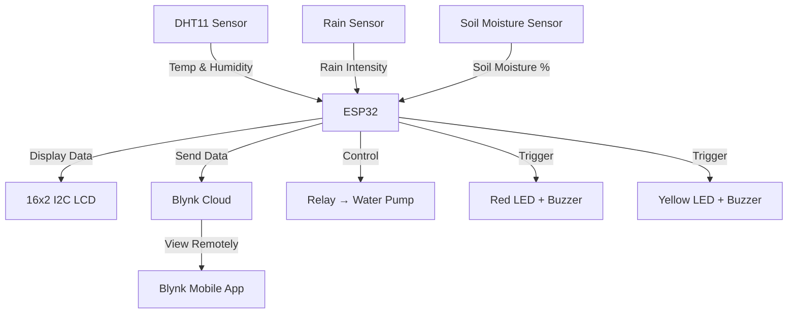

# 🌾 IoT Based Smart Farming System

<p align="center">
  
</p>

<p align="center">
  <b>An intelligent, real-time agricultural monitoring system powered by ESP32, Blynk IoT cloud, and multiple sensors — built to help farmers make data-driven decisions and automate farm management.</b>
</p>

<p align="center">
  
  
  
  
</p>

---

## 📋 Table of Contents

- [Overview](#overview)
- [Features](#features)
- [Hardware Requirements](#hardware-requirements)
- [Circuit Diagram](#circuit-diagram)
- [Pin Configuration](#pin-configuration)
- [Software Requirements](#software-requirements)
- [Installation & Setup](#installation--setup)
- [How It Works](#how-it-works)
- [Sensor Specifications](#sensor-specifications)
- [Blynk Dashboard Setup](#blynk-dashboard-setup)
- [Contributors](#contributors)
- [License](#license)

---

## 🔍 Overview

The **IoT Based Smart Farming System** is a complete agricultural monitoring and automation solution. It continuously tracks key environmental parameters — **temperature, humidity, rainfall intensity, and soil moisture** — and displays them on a 16x2 LCD screen while sending real-time data to the **Blynk IoT cloud platform**.

The system automates irrigation by controlling a **water pump relay** based on soil moisture levels and triggers **audio-visual alerts** when rainfall is detected or soil is too dry, helping farmers respond immediately to changing field conditions.

---

## ✨ Features

- ✅ **Real-time monitoring** of temperature, humidity, rainfall, and soil moisture
- ✅ **Cloud-connected** — view data remotely via the Blynk mobile app
- ✅ **16x2 I2C LCD display** — local readout of all sensor values
- ✅ **Automatic irrigation control** — relay-driven water pump turns on/off based on soil moisture
- ✅ **Rain alert system** — red LED + buzzer activate when rain is detected
- ✅ **Dry soil alarm** — yellow LED + buzzer when soil is too dry
- ✅ **WiFi-enabled ESP32** — connects to the cloud wirelessly
- ✅ **Modular code structure** — easy to extend with additional sensors

---

## 🧰 Hardware Requirements

| Component | Quantity | Purpose |
|-----------|----------|---------|
| ESP32 Development Board | 1 | Main microcontroller with WiFi |
| DHT11 Temperature & Humidity Sensor | 1 | Measures ambient temp & humidity |
| Rain Sensor Module (LM393) | 1 | Detects rainfall intensity |
| Soil Moisture Sensor (YL-69) | 1 | Measures soil moisture level |
| 16x2 I2C LCD Display | 1 | Local data display |
| 5V Relay Module | 1 | Controls water pump |
| Red LED (5mm) | 1 | Rain alert indicator |
| Yellow LED (5mm) | 1 | Dry soil indicator |
| Buzzer (5V) | 1 | Audible alert |
| Breadboard & Jumper Wires | - | Prototyping & connections |
| Power Supply (5V / USB) | 1 | Powers the system |

---

## 🔌 Circuit Diagram

<p align="center">
  
  <br>
  <em>Complete wiring diagram for the Smart Farming System</em>
</p>

---

## 📍 Pin Configuration

| ESP32 Pin | Connected To |
|-----------|--------------|
| GPIO 14 (TH) | DHT11 Data Pin |
| GPIO 35 (Rain) | Rain Sensor Analog Output |
| GPIO 34 (Soil) | Soil Moisture Sensor Analog Output |
| GPIO 12 (redled) | Red LED (Rain Alert) |
| GPIO 13 (yellowled) | Yellow LED (Dry Soil Alert) |
| GPIO 27 (buzzer) | Buzzer |
| GPIO 25 (relay) | Relay Module (Water Pump) |
| SDA (GPIO 21) | LCD I2C SDA |
| SCL (GPIO 22) | LCD I2C SCL |

---

## 💻 Software Requirements

- [Arduino IDE](https://www.arduino.cc/en/software) (v1.8.x or later)
- [ESP32 Board Package](https://github.com/espressif/arduino-esp32) — install via Boards Manager
- Required Libraries (install via Library Manager):
  - `Blynk` by Volodymyr Shymanskyy
  - `DHT sensor library` by Adafruit
  - `LiquidCrystal_I2C` by Frank de Brabander
  - `WiFiClient` (built-in with ESP32 package)

---

## 🛠 Installation & Setup

### 1️⃣ Clone or Download

```bash
git clone https://github.com/cherrysharma3094-ai/IoT-Smart-Farming-System.git
```

### 2️⃣ Open the Code

Open `code/code.ino` in Arduino IDE.

### 3️⃣ Configure WiFi & Blynk

Edit the following lines in `code.ino` with your credentials:

```cpp
char auth[] = "YOUR_BLYNK_AUTH_TOKEN";   // From Blynk app
char ssid[] = "YOUR_WIFI_SSID";          // Your WiFi name
char pass[] = "YOUR_WIFI_PASSWORD";      // Your WiFi password
```

> **⚠️ Security Note:** Never commit real WiFi credentials or Blynk tokens to public repos. Use environment variables or a separate config file in production.

### 4️⃣ Upload to ESP32

1. Select **Board**: `ESP32 Dev Module`
2. Select **Port**: The COM port your ESP32 is connected to
3. Click **Upload**

### 5️⃣ Power Up

Once uploaded, the system will:
- Connect to WiFi
- Connect to Blynk cloud
- Start displaying sensor data on the LCD
- Send data to the Blynk app every ~500ms

---

## ⚙️ How It Works



### Sensor Logic

| Condition | Action |
|-----------|--------|
| 🌧️ Rainfall ≥ 20% | Red LED ON, Buzzer ON, Blynk alert |
| 🌿 Soil Moisture ≥ 40% | Yellow LED OFF, Buzzer OFF, Relay OFF (no water needed) |
| 🏜️ Soil Moisture < 40% | Yellow LED ON, Buzzer ON, Relay ON (water pump starts) |
| 📊 Every reading | Data sent to Blynk V0–V4 virtual pins |

---

## 📊 Sensor Specifications

### DHT11
- **Temperature Range:** 0–50°C (±2°C accuracy)
- **Humidity Range:** 20–90% RH (±5% accuracy)

### Rain Sensor
- **Type:** LM393 analog comparator module
- **Output:** Analog 0–4095 (mapped to 0–100%)

### Soil Moisture Sensor
- **Type:** YL-69 resistive sensor
- **Output:** Analog 0–4095 (mapped to 0–100%)

---

## 📱 Blynk Dashboard Setup

1. Download the **Blynk IoT** app (legacy Blynk is deprecated)
2. Create a new template called "Smart Farming System"
3. Add the following **Virtual Pins**:

| Virtual Pin | Parameter | Widget Type |
|-------------|-----------|-------------|
| V0 | Temperature (°C) | Value Display / Gauge |
| V1 | Humidity (%) | Value Display / Gauge |
| V2 | Soil Moisture (%) | Value Display / Gauge |
| V3 | Rain Alert | LED Widget |
| V4 | Rainfall (%) | Value Display / Gauge |

4. Copy the **Auth Token** from the app and paste it into `code.ino`

---

## 👥 Contributors

<p align="center">
  <a href="https://github.com/cherrysharma3094-ai">
    
  </a>
  &nbsp;&nbsp;
  <a href="https://github.com/Deep007h">
    
  </a>
</p>

| Name | Role | GitHub |
|------|------|--------|
| **Chirag Sharma** | Developer & Circuit Design | [@cherrysharma3094-ai](https://github.com/cherrysharma3094-ai) |
| **Harshdeep Singh** | Co-Developer & Testing | [@Deep007h](https://github.com/Deep007h) |
| **Akashdeep** | *(coming soon)* | — |

---

## 📄 License

This project is licensed under the **MIT License** — see the [LICENSE](LICENSE) file for details.

---

<p align="center">
  <b>🌱 Empowering farmers with smart technology for a sustainable future.</b>
  <br>
  Made with ❤️ by Chirag Sharma & Team
</p>
